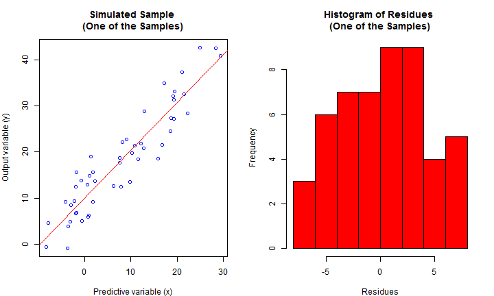
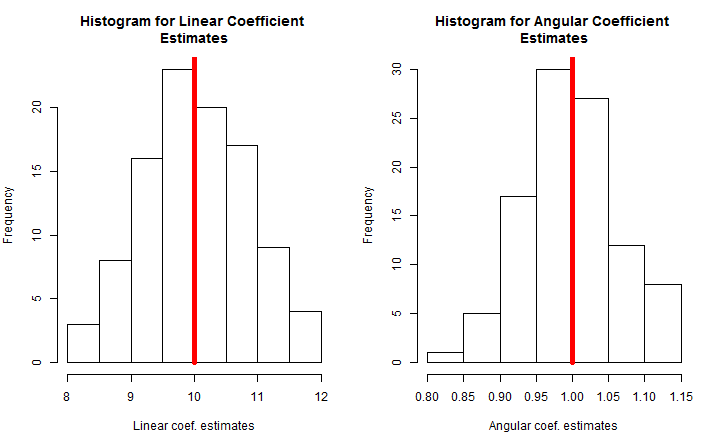

Simulating Sample Distribution for OLS Estimators - Developing Data Products Course
========================================================
author: Alexandre Xavier Ywata Carvalho, Ph.D.
date: September 21, 2014

Introduction
========================================================

- We created a simple application to demonstrate the behavior of the ordinary least squares (OLS) estimator, under different samples. 

- The user can choose the regression errors standard deviation, regression linear coefficient and regression angular coefficient. 

- It is possible to select the number of observations in each sample and the number of simulations. 

- The higher the number of simulations or the sample size, the more intensive the computations will be.

- Go to: https://simulationexamples.shinyapps.io/Deploy/

Simulated Regression Data
========================================================

- Simulating a regression sample data, with linear coefficient = 10, angular coefficient = 1.0, errors standard deviation = 4, and number of observations = 50

 

Distribution for OLS Estimates
========================================================

- Simulating 100 samples, with 50 observations each, and estimated the coefficients using OLS -> we can analyze the behavior of the 100 estimates for both coefficients

 

Conclusions
========================================================

- Simulations can be a powerful tool for teaching statistical concepts

- By using R, we can build reproducible codes and examples, enhancing students experience in learning statisics and econometrics

- Slidify and Shiny are wonderful tools to demonstrate the power and the usefuness of statistical tools

- We are certainly in the midst of revolutionary process of teaching and learning applied mathematical techniques 
